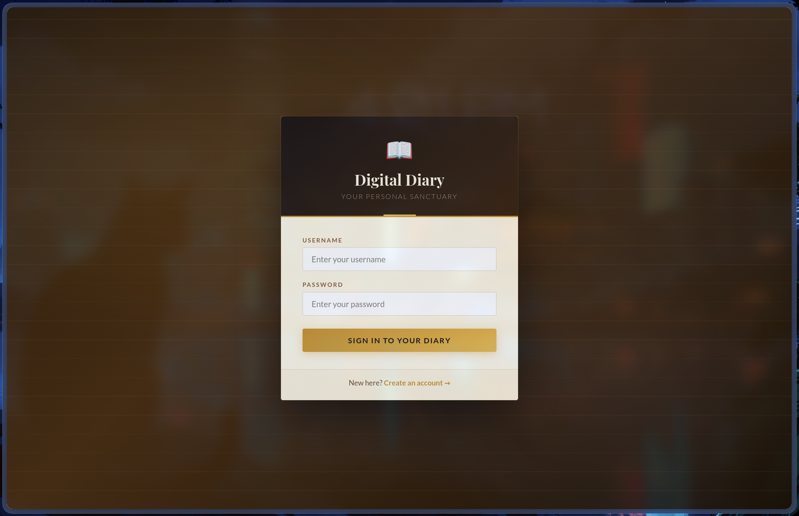
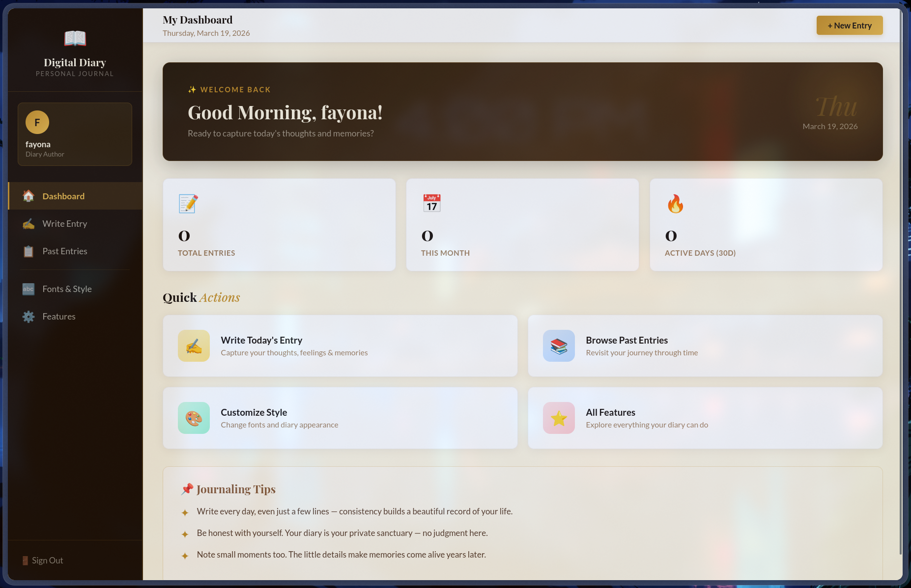
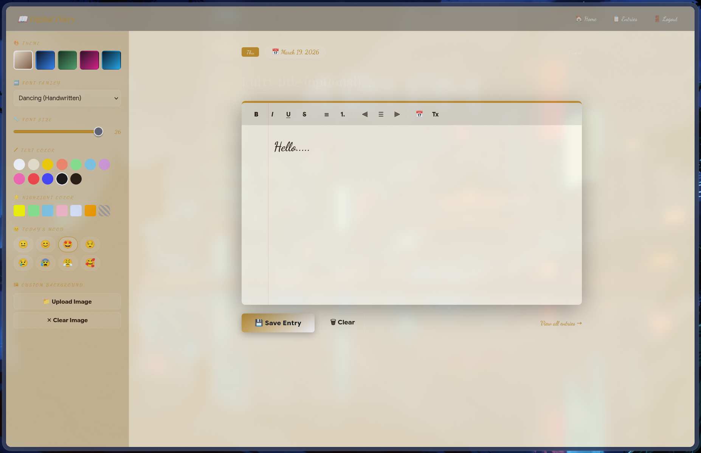

# 📖 Digital Diary

A beautifully designed personal journaling web application built with **PHP** and **SQLite3**. Write, style, and revisit your diary entries with a rich set of customization features — all running locally with zero external dependencies.


---

## 📸 Screenshots

### 🔐 Login Page


### 🏠 Dashboard


### ✍️ Writing Page


---

## ✨ Features

### 🎨 5 Beautiful Themes
Switch between fully styled themes that transform the entire writing environment:
- **Parchment** — warm amber/gold, classic diary feel
- **Midnight** — deep dark blue with electric blue accents
- **Forest** — rich dark green with emerald accents
- **Rose** — deep burgundy with magenta accents
- **Ocean** — navy dark with sky blue accents

### ✍️ Rich Text Editor
A full formatting toolbar built into the diary page:
- Bold, Italic, Underline, Strikethrough
- Bullet lists and numbered lists
- Text alignment (left, center, right)
- **12 text colors** to write in any color you choose
- **6 highlight colors** to mark important passages
- Insert today's date with one click
- Clear formatting button

### 🔤 7 Font Choices
Pick the font that matches your writing mood — persists across sessions:
- **Lato** — Clean & Modern
- **Playfair Display** — Elegant & Serif
- **Merriweather** — Classic & Readable
- **Dancing Script** — Handwritten Style
- **Source Code Pro** — Typewriter Mono
- **Georgia** — Newspaper Classic
- **Impact** — Bold & Punchy

### 📏 Font Size Slider
Adjust your writing font size from 12px to 26px using a live slider.

### 😊 Mood Tracker
Tag every entry with your current mood:
😐 Neutral · 😊 Happy · 🤩 Excited · 😌 Calm · 😢 Sad · 😰 Anxious · 😤 Angry · 🥰 Love

### 📋 Past Entries Browser
- Card grid view of all your diary entries
- **Full-text search** across all entries and titles
- **Month filter** to browse by time period
- Click any card to read in a full-screen modal
- Word count displayed per entry
- Delete entries with confirmation

### 📊 Dashboard Stats
- Total entries written
- Entries written this month
- Active writing days in the last 30 days

### 🖼 Custom Background
Upload your own photo as a background for the writing area.

### 🔐 User Authentication
- Secure registration and login
- Passwords hashed with PHP's `password_hash()`
- Session-based authentication
- Each user's entries are fully private

---

## 📁 Project Structure

```
digital-diary/
├── index.php         ← Login page
├── register.php      ← Registration page
├── start.php         ← Dashboard / Home
├── diary.php         ← Main writing page (themes, editor, mood)
├── entries.php       ← Browse & search past entries
├── fonts.php         ← Font selection page
├── features.php      ← Features overview page
├── connect.php       ← SQLite3 database connection
├── set_pref.php      ← AJAX helper for saving theme/font preferences
├── logout.php        ← Session destroy & redirect
├── screenshots/      ← App screenshots
│   ├── login.png
│   ├── dashboard.png
│   └── diary.png
└── README.md
```

> `diary.db` is auto-created in the project folder on first run. It is excluded from version control via `.gitignore`.

---

## 🚀 How to Run

### Prerequisites
- **PHP 8.x** with **SQLite3** extension enabled

---

### Linux (Arch / CachyOS / Manjaro)
```bash
sudo pacman -S php php-sqlite
```

Enable SQLite in PHP config:
```bash
sudo nano /etc/php/php.ini
# Find ;extension=sqlite3 and remove the semicolon
# Save: Ctrl+O → Enter → Ctrl+X
```

### Linux (Ubuntu / Debian / Mint)
```bash
sudo apt update && sudo apt install php php-sqlite3 -y
```

### Windows / Mac
Download and install [XAMPP](https://www.apachefriends.org) which includes PHP and SQLite out of the box.

---

### Running the project

**Option A — PHP built-in server (Linux/Mac, recommended)**
```bash
git clone https://github.com/HibaFayona/Digital-Diary.git
cd digital-diary
php -S localhost:8000
```
Open in browser: **http://localhost:8000/index.php**

**Option B — XAMPP (Windows/Mac/Linux)**
1. Copy the project folder into `htdocs/`
2. Start Apache from XAMPP Control Panel
3. Open: **http://localhost/digital-diary/index.php**

---

### First time setup
1. Open the app in your browser
2. Click **"Create an account"** and register
3. Log in — the dashboard will greet you
4. Head to **Write Entry** and start journaling!

> The `diary.db` SQLite database file is created automatically on first visit. No manual database setup required.

---

## 🛠 Tech Stack

| Layer     | Technology                        |
|-----------|-----------------------------------|
| Backend   | PHP 8.x                           |
| Database  | SQLite3 (file-based, no server)   |
| Frontend  | HTML5, CSS3, Vanilla JavaScript   |
| Fonts     | Google Fonts                      |
| Auth      | PHP Sessions + password_hash()    |

---

## 🔒 Security Notes

- All user input is sanitized with `htmlspecialchars()`
- Database queries use **prepared statements** to prevent SQL injection
- Passwords stored as **bcrypt hashes** via `password_hash()`
- Font and theme values are **whitelisted** before being stored in session

---

## 📄 License

MIT License — free to use, modify, and distribute.

---

## 👤 Author

Made by **HibaFayona**  
[github.com/HibaFayona](https://github.com/HibaFayona)
